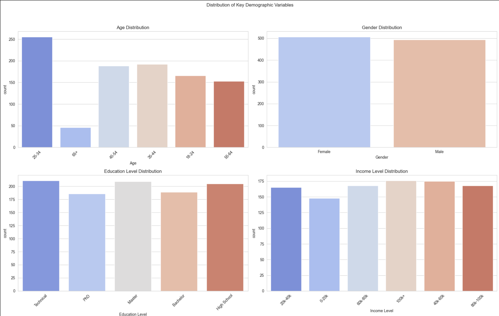
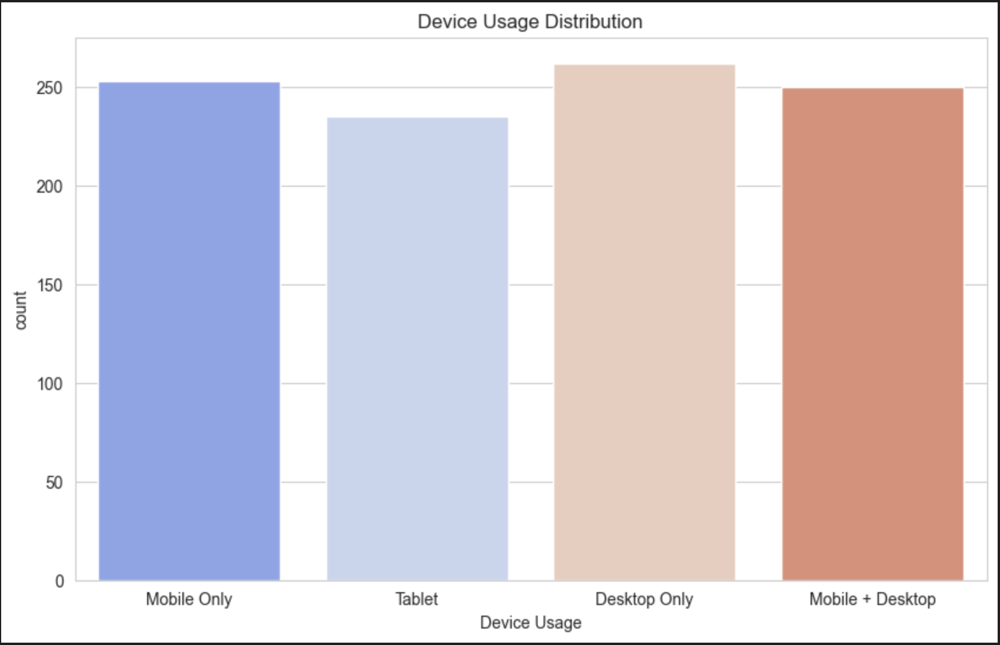
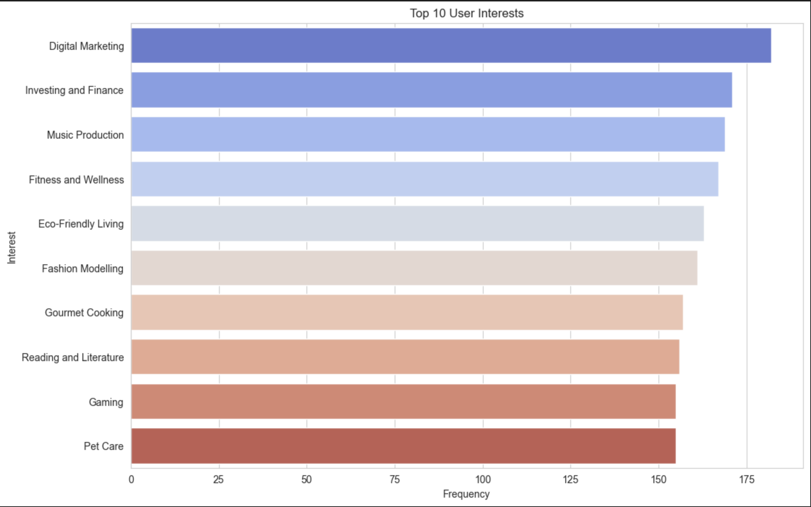
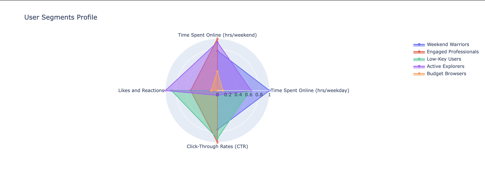

#  User Segmentation ML Project (K-Means Clustering)

##  Project Goal

The primary objective of this project is to perform **user segmentation** based on their behavioral data (online activity, engagement, and click-through rates). By using the **K-Means clustering** algorithm, the project creates clear, actionable user profiles to enhance targeted advertising and personalize marketing strategies.

---

##  Methodology

This project follows a professional, modular structure:

1.  **Data Preprocessing:** Key behavioral features are extracted and standardized using `StandardScaler` to prepare the data for clustering.
2.  **Modular Code:** Preprocessing logic (scaling, feature selection, and cluster mean calculation) is centralized in the **`src/preprocessing.py`** module for code cleanliness and reusability.
3.  **Clustering:** The K-Means algorithm is applied to segment the user base into **5 distinct clusters**.
4.  **Model Persistence:** The trained $K$-Means model and the fitted scaler are saved using `joblib` into the **`models/`** directory for future deployment.
5.  **Visualization:** A **Radar Chart** is used to visually compare the profiles of the five identified user segments.

---

##  Key Findings (Segment Profiles)

The analysis resulted in five clearly defined user segments, each named based on their most defining characteristics:

| Cluster | Name | Key Characteristics | Marketing Recommendations |
| :---: | :--- | :--- | :--- |
| **0** | **Weekend Warriors** | High activity on weekends, moderate overall engagement. | Schedule peak advertising during Saturday and Sunday. |
| **1** | **Engaged Professionals** | Balanced week/weekend activity, **highest overall likes/reactions**. | Focus on high-quality content; steady ad budget throughout the week. |
| **2** | **Low-Key Users** | Consistently low metrics across all features. | Target with "cold" lead generation funnels focusing on initial awareness. |
| **3** | **Active Explorers** | High weekday and weekend activity, **high Click-Through Rates (CTR)**. | Use action-oriented ads that encourage immediate interaction. |
| **4** | **Budget Browsers** | Low recorded income, moderate online activity. | Focus campaigns heavily on discounts, sales, and promotional offers. |

...
### Segment Comparison (Radar Chart)

The Radar Chart below visually demonstrates the strengths and weaknesses of each segment across the key behavioral metrics.

**Radar Chart Visualization**

*Figure 1: Comparison of Segment Means across Key Features (Radar Chart)*

---

### Supporting Visualizations

Detailed distribution plots supporting the segmentation results:

**Likes and Reactions by Cluster**
 
*Figure 2: Distribution of Likes and Reactions across 5 Clusters*

**Time Spent Online (Weekday) by Cluster**

*Figure 3: Distribution of Weekday Online Time across 5 Clusters*

**Time Spent Online (Weekend) by Cluster**
 
*Figure 4: Distribution of Weekend Online Time across 5 Clusters*

**Click-Through Rates (CTR) by Cluster**
 
*Figure 5: Distribution of Click-Through Rates across 5 Clusters*

...

### Segment Comparison (Radar Chart)

The Radar Chart below visually demonstrates the strengths and weaknesses of each segment across the key behavioral metrics.

*\[**Insert your Plotly Radar Chart Image here**]*

---

##  Project Structure

The repository adheres to a standard data science project layout, ensuring clarity and reproducibility:

User_Segmentation_ML/

    ├── data/

    │   └── user_profiles_for_ads.csv          # Raw input user data for segmentation

    │
  
    ├── models/

    │   ├── kmeans_model.joblib                # Trained K-Means clustering model

    │   └── data_scaler.joblib                 # Fitted StandardScaler for feature scaling

    │

    ├── notebooks/

    │   └── user_segmentation_analysis.ipynb   # Main exploratory analysis & modeling notebook

    │

    ├── src/

    │   └── preprocessing.py                   # Reusable functions (cleaning, scaling, feature prep)

    │

    ├── .gitignore                             # Ignore venv/, models/, checkpoints, etc.

    ├── requirements.txt                       # Python dependencies for the project

    └── README.md                              # Project description and usage instructions


##  Setup and Execution

To run this project locally, follow these steps:

1.  **Clone the repository:**
    ```bash
    git clone
    cd User_Segmentation_ML
    ```

2.  **Create and activate the virtual environment (venv):**
    ```bash
    python -m venv venv
    source venv/bin/activate  # macOS/Linux
    # or
    .\venv\Scripts\activate  # Windows
    ```

3.  **Install project dependencies:**
    ```bash
    pip install -r requirements.txt
    ```

4.  **Run the analysis:**
    * Open **`notebooks/user_segmentation_analysis.ipynb`** in VS Code or Jupyter Lab.
    * Run all cells sequentially. *Note: Ensure the path-fixing cell (`sys.path.append`) is run first to load the modules from `src/`.*

---

##  Technologies Used

* **Python 3.x**
* **Pandas** (Data Manipulation)
* **Scikit-learn** (K-Means Clustering, Scaling)
* **Plotly** (Interactive Data Visualization)
* **Joblib** (Model Persistence)


Author:
Nikita Marshchonok
linkedIn: https://www.linkedin.com/in/nikita-marshchonok
Github: https://github.com/NikitaMarshchonok
